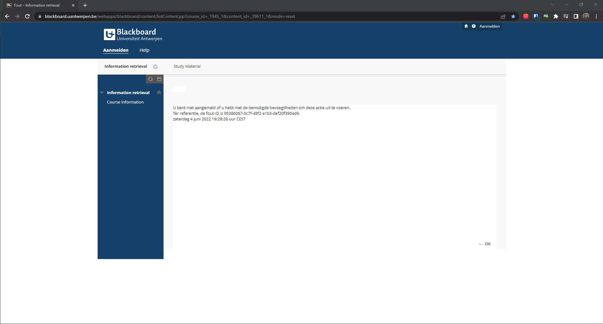
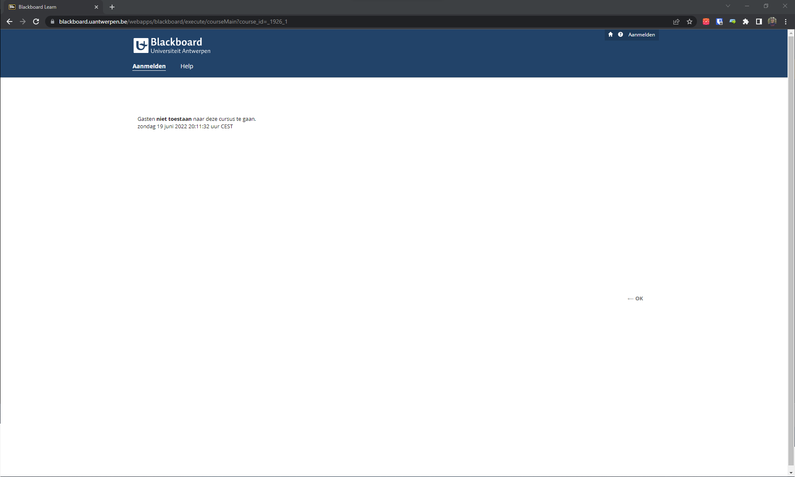
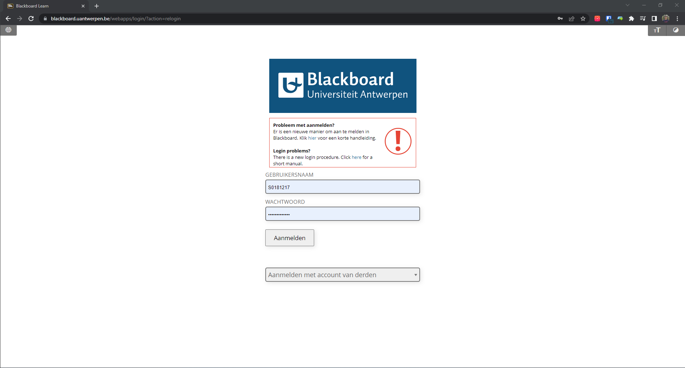
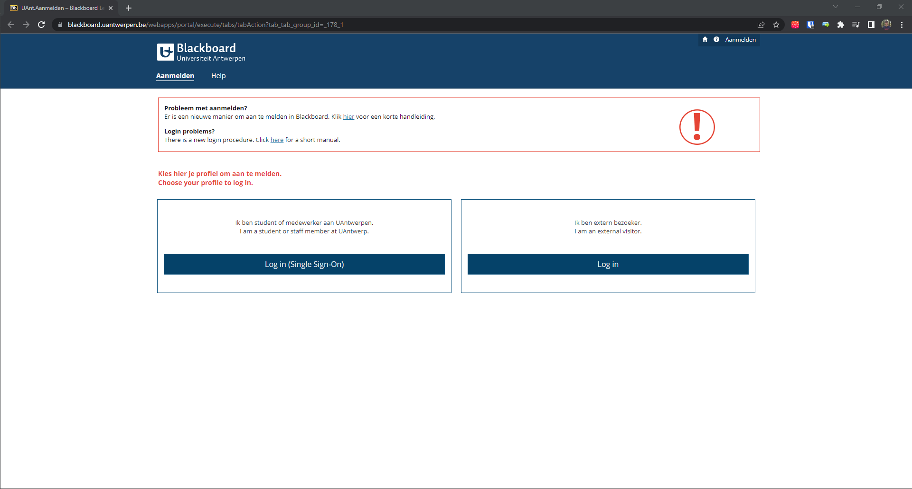
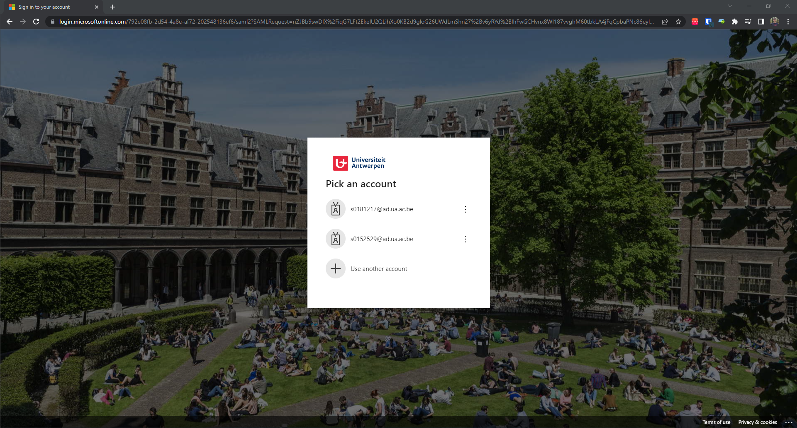
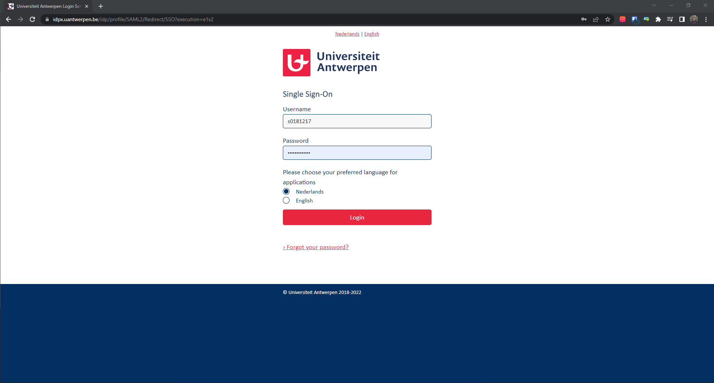
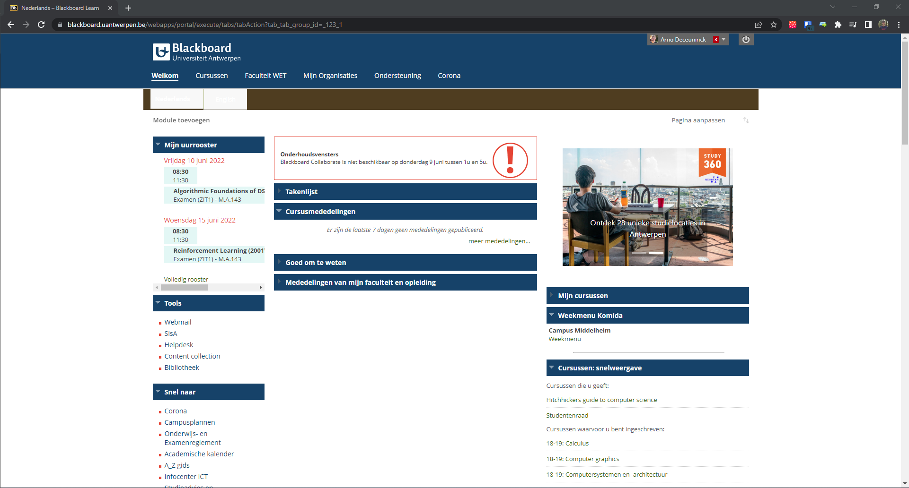

# uantwerpen-login-extension
Note: This plugin works on the site of the University of Antwerp, but I (the author) have made this project on my own and thus the university is for nothing from this plugin responsible. 

## Download
You can install the plugin from the Chrome Webstore using [this link](https://chrome.google.com/webstore/detail/uantwerpen-login/gcgaojpamgfhhaojdhfbjbagpajeddnd)
## Promo video
Small promo video of the extension (made for the Chrome Webstore) can be found in [promo.mp4](promo.mp4).
<video src='promo.mp4' width=180/></video>

## Problem when you don't have the extension
BlackBoard logs you out once in a while. In order to login again, you have to make way too many clicks. 

Click 1: First click is "Aanmelden" at the top right corner [here](https://blackboard.uantwerpen.be/webapps/blackboard/content/listContent.jsp?course_id=_1945_1&content_id=_39611_1&mode=reset) (since the "OK" button does nothing)

Click 1 (in some other cases)

Click 2 (actually 2 clicks): Next click is selecting "Aanmelden met account van derden" and "UAntwerpen SSO" on [this page](https://blackboard.uantwerpen.be/webapps/login/?action=relogin). 

Click 2 (for some other people)

Click 3: Next click is selecting your account on [this page](https://login.microsoftonline.com/792e08fb-2d54-4a8e-af72-202548136ef6/saml2?SAMLRequest=nZJBb9swDIX%2FiqG7LFt2EkeIU2QLihXo0KB2d9gloG26UWdLmShn27%2Bv6yRYd%2BlhFwGCHvnx8Wl187vvghM60tbkLA4jFqCpbaPNc86eyluesZv1iqDv5FFtBn8wj%2FhzQPLBWGhInV9yNjijLJAmZaBHUr5WxebrvZJhpI7OelvbjgUbInR%2BRH22hoYeXYHupGt8erzP2cH7Iykhqg7qH5UF14QDGP8L3RFNWKGAEc%2FfgGI6iuJBQKeBxF7Gch%2BzYDvOpQ34ycu1XWeftQl7XTtLtvXWdNpgWNteLJYSo6ytuGxmKU8hQw7tQnIZyVmaxckc2%2FmEkiy4ta7GyX%2FOWugIWXC3zRkskhQOzUsNGQDEs0ou25c2rXSVzJPDqKEdEOkT%2Fq0iGvDOkB%2Bt5WxESR7NeZSW8UIlmZJZmCyz7yzYXZb2SZtzGB9tuDqLSH0pyx3fPRQlC75dQx0F7BKhmujufXYfN4ZrYGz9P%2FGg8dr%2F4boRbx33m%2B1KvJ9jfbn%2B%2B7PWrw%3D%3D&SigAlg=http%3A%2F%2Fwww.w3.org%2F2001%2F04%2Fxmldsig-more%23rsa-sha256&Signature=IavgGLDMvjd%2FCWPlWvYCHaddLp3YISJI%2B3Q4x5FhFHb6KDnMlCTYzAIB1ZHfoV%2BzrRwJJsxhtAk50dRxGFJTBrS4E9RORY9QOb0eqbHEW6tWvA9tkhIaR9hyjeTPNSANaSsCg85dmyyuuyidqOcsdY%2BVnjUcoBjvWo6rpdBtMsOVWyF5z%2Ba0mHj0f7RgYAZWHqhxDZuOzYTSNe14%2FVaCtbzJEREVVP3CvkyEiVh1WEsGMH6342tTWm7E%2FL9x1ZZETrcMkPzTBet7PfoxlwJFdBklUXhc%2FAXTcrF1KEFFg0TIL6tcR0Fh%2FFUVfM%2FTilF9mf3VVFCDYixfVLna4Ia3WQ%3D%3D&sso_reload=true)

Click 4: This takes you to your [organizations login page](https://idpx.uantwerpen.be/idp/profile/SAML2/Redirect/SSO?execution=e1s2), where you have to perform yet another click. 

Click 5: And after all this, you're finally signed in to BlackBoard, but you're at the front page and not the page you initially started on.

Extra: Selects studentenportaal here

If there are any additional steps, please let me know and I'll add them to the list.

## Solution
This extensions does most of the clicks for you, so you'll only have to enter your password and perform click 4. The extension will even redirect you automatically to the page you started on.

## Logging in with another microsoft account
It automatically select the first microsoft account. If you want to login with another Microsoft account, you can disable the extension (temporarily) by going to [chrome://extensions](chrome://extensions) and switching it off.

## Problems? 
If you have any problems, please contact me by [email](mailto:arno.deceuninck@student.uantwerpen.be) or open an issue on GitHub. 